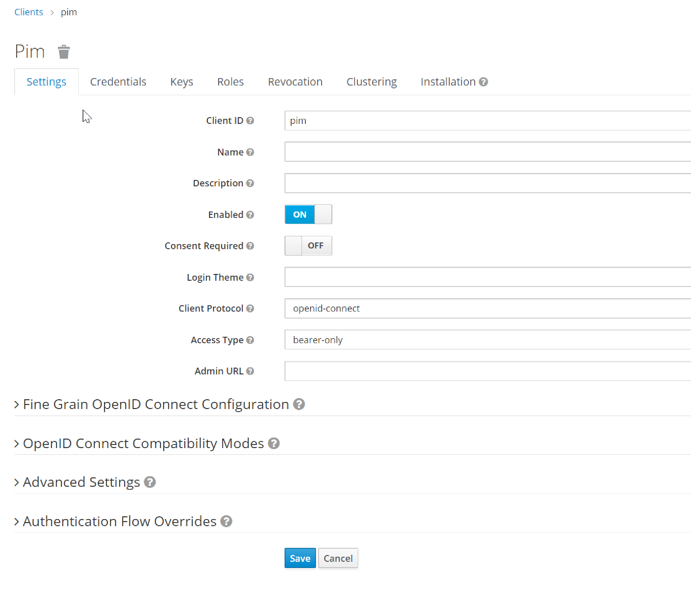

http://localhost:8082/q/dev/io.quarkus.quarkus-oidc/provider

we don't have access to DEV-UI/keycloak if the Access Type is : bearer-only

We will get this error message :
Bearer-only applications are not allowed to initiate browser login

